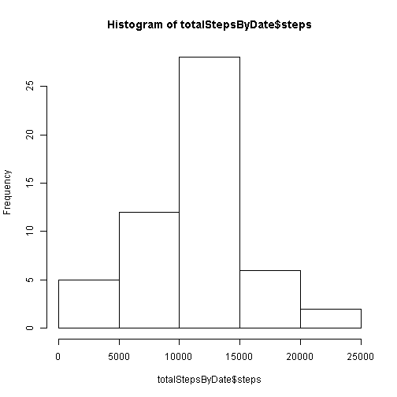

# Reproducible Research: Peer Assessment 1


## Loading and preprocessing the data


```r
data<-read.csv("data/activity.csv")
```

## What is mean total number of steps taken per day?


```r
totalStepsByDate<-aggregate(steps ~ date, data, sum,na.rm=T)
hist(totalStepsByDate$steps)
```

 

```r
mean(totalStepsByDate$steps, na.rm=T)
```

```
## [1] 10766
```

```r
median(totalStepsByDate$steps, na.rm=T)
```

```
## [1] 10765
```


## What is the average daily activity pattern?


## Imputing missing values


## Are there differences in activity patterns between weekdays and weekends?
