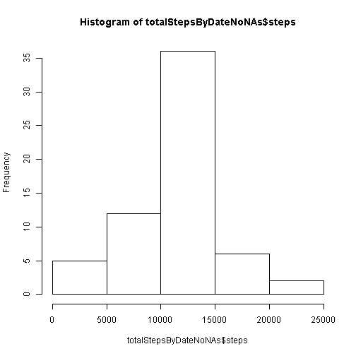
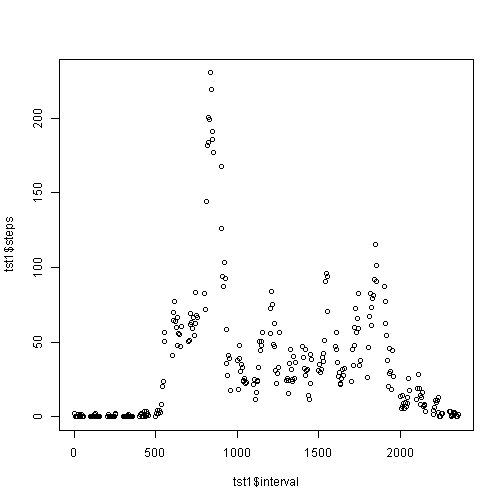
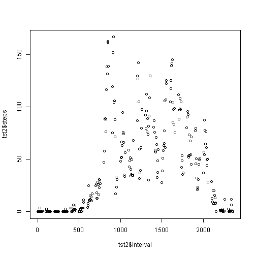

# Reproducible Research: Peer Assessment 1


## Loading and preprocessing the data


```r
data<-read.csv("data/activity.csv")
```

## What is mean total number of steps taken per day?


```r
totalStepsByDate<-aggregate(steps ~ date, data, sum,na.rm=T)
hist(totalStepsByDate$steps)
```

 

```r
mean(totalStepsByDate$steps, na.rm=T)
```

```
## [1] 10766
```

```r
median(totalStepsByDate$steps, na.rm=T)
```

```
## [1] 10765
```


## What is the average daily activity pattern?

```r
meanStepsByInterval<-aggregate(steps ~ interval, data, mean,na.rm=T)
plot(meanStepsByInterval$interval,meanStepsByInterval$steps)
```

 

```r
meanStepsByInterval[which.max( meanStepsByInterval[,2] ),]
```

```
##     interval steps
## 104      835 206.2
```

## Imputing missing values

```r
nrow(data) - sum(complete.cases(data))
```

```
## [1] 2304
```

```r
dataNoNAs <- data
for (i in 1:nrow(dataNoNAs))
{
  if(is.na(dataNoNAs[i,1]))
  {
    dataNoNAs[i,1]<-meanStepsByInterval[meanStepsByInterval$interval == dataNoNAs[i,3],2]
  }
}
nrow(data[is.na(data$steps),])
```

```
## [1] 2304
```

```r
nrow(dataNoNAs[is.na(dataNoNas$steps),])
```

```
## Error: object 'dataNoNas' not found
```

```r
totalStepsByDateNoNAs<-aggregate(steps ~ date, dataNoNAs, sum,na.rm=T)
hist(totalStepsByDateNoNAs$steps)
```

 

```r
mean(totalStepsByDateNoNAs$steps, na.rm=T)
```

```
## [1] 10766
```

```r
median(totalStepsByDateNoNAs$steps, na.rm=T)
```

```
## [1] 10766
```

## Are there differences in activity patterns between weekdays and weekends?

```r
dayType <-apply(dataNoNAs,1,function(row) 
  {
    if(weekdays(as.Date(row[2],"%Y-%m-%d"))=="Sunday" ||
         weekdays(as.Date(row[2],"%Y-%m-%d"))=="Saturday")
      { "weekend" }
   else
      { "weekday" }
   })
dataNoNAs<-data.frame(dataNoNAs,dayType)
head(dataNoNAs)
```

```
##     steps       date interval dayType
## 1 1.71698 2012-10-01        0 weekday
## 2 0.33962 2012-10-01        5 weekday
## 3 0.13208 2012-10-01       10 weekday
## 4 0.15094 2012-10-01       15 weekday
## 5 0.07547 2012-10-01       20 weekday
## 6 2.09434 2012-10-01       25 weekday
```


```r
meanStepsByIntervalDayFactor<-aggregate(steps ~ interval+dayType, dataNoNAs, mean,na.rm=T)
tst1<-meanStepsByIntervalDayFactor[meanStepsByIntervalDayFactor$dayType=="weekday",]
tst2<-meanStepsByIntervalDayFactor[meanStepsByIntervalDayFactor$dayType=="weekend",]
plot(tst1$interval,tst1$steps)
```

 

```r
plot(tst2$interval,tst2$steps)
```

 
