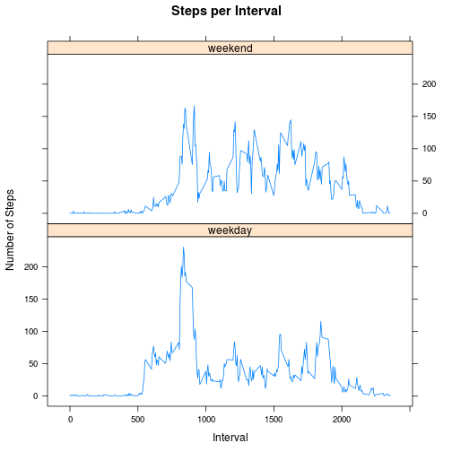

# Reproducible Research: Peer Assessment 1


## Loading and preprocessing the data
For this analysis, the dataset was downloaded and read into R.


```r
setwd("~/GitHub/RepData_PeerAssessment1")
data<-read.csv("data/activity.csv")
```

## What is mean total number of steps taken per day?
To calculate the mean and median steps per day, the data was aggregated by date. For these calculations, blank/missing entries were ignored.


```r
totalStepsByDate<-aggregate(steps ~ date, data, sum,na.rm=T)
```
A histogram was created from this by using the hist command as follows:


```r
hist(totalStepsByDate$steps, xlab = "Average Daily Steps Taken", ylab="Frequency", 
     main="Frequency of the Average Daily Steps Taken")
```

 

In order to get the mean and median of steps taken by day, the mean and median functions respectively were executed on the aggregated steps variable.


```r
dataMean<-mean(totalStepsByDate$steps, na.rm=T)
dataMedian<-median(totalStepsByDate$steps, na.rm=T)
dataMean;dataMedian
```

```
## [1] 10766
```

```
## [1] 10765
```
The mean number of steps per day was found to be **10766** and the median number of steps per day was **10765**.

## What is the average daily activity pattern?
The steps counts by interval over all days were aggregated and the results were plotted:


```r
meanStepsByInterval<-aggregate(steps ~ interval, data, mean,na.rm=T)
plot(meanStepsByInterval$interval,meanStepsByInterval$steps, xlab="Interval Number",ylab = "Average Steps", main="Average Steps per Interval for all Days")
```

 

To find the interval with the largest average steps count, the which.max function was used to retrieve its index in the data frame:


```r
largestMean<-meanStepsByInterval[which.max( meanStepsByInterval[,2] ),]
largestMean
```

```
##     interval steps
## 104      835 206.2
```

The largest average number of steps was **206.2**, occuring in interval **835**.

## Imputing missing values
The number of rows with missing values was calculated:


```r
nrow(data) - sum(complete.cases(data))
```

```
## [1] 2304
```

For each missing value, the average for its corresponding interval was used instead, and assigned to a copy of the original dataset for further analysis.


```r
dataNoNAs <- data
for (i in 1:nrow(dataNoNAs))
{
  if(is.na(dataNoNAs[i,1]))
  {
    dataNoNAs[i,1]<-meanStepsByInterval[meanStepsByInterval$interval == dataNoNAs[i,3],2]
  }
}
```
It was then confirmed that the resulting dataset did not have any missing values:

```r
nrow(dataNoNAs[is.na(dataNoNAs$steps),])
```

```
## [1] 0
```

The average steps counts were aggregated by date and a histogram was plotted. 

```r
totalStepsByDateNoNAs<-aggregate(steps ~ date, dataNoNAs, sum,na.rm=T)
hist(totalStepsByDateNoNAs$steps,xlab = "Average Daily Steps Taken", ylab="Frequency", 
     main="Frequency of the Average Daily Steps Taken")
```

 

The mean and median of this modified data was calculated as before.

```r
mean(totalStepsByDateNoNAs$steps, na.rm=T)
```

```
## [1] 10766
```

```r
median(totalStepsByDateNoNAs$steps, na.rm=T)
```

```
## [1] 10766
```

## Are there differences in activity patterns between weekdays and weekends?
A factor variable was assigned to each record indicating whether the record represents a week day or weekend day, and a new data frame was created with the extra column in addition to the original dataset.

```r
weekendDays <-c("Saturday", "Sunday")
dayType <-apply(dataNoNAs,1,function(row) 
  {
    ifelse(weekdays(as.Date(row[2],"%Y-%m-%d")) %in% weekendDays, "weekend","weekday")
   })
dataNoNAs<-data.frame(dataNoNAs,dayType=as.factor(dayType))
```

This data was aggregated by interval and dayType, and a graph comparing the averages by interval for each of the dayType factor values was plotted with the lattice package's xyplot command.


```r
library(lattice)

aggregatedData <- aggregate(steps ~ interval+dayType, dataNoNAs, mean)
xyplot(steps~interval|dayType, aggregatedData,
   type = "l",
   main="Steps per Interval", 
   ylab="Number of Steps", xlab="Interval",
   layout=c(1,2))
```

 

It was noted form the graph that a single maximum spike was seen in the steps for weekdays, but that there was a  relatively more constant amount of steps over a wider range of intervals for weekend days.
